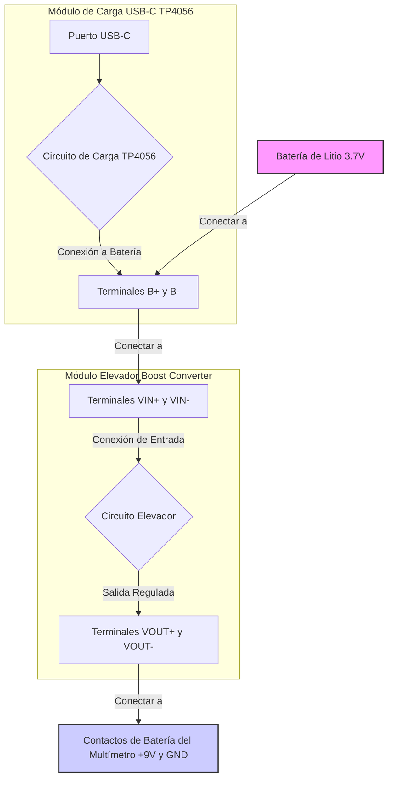

# Fuente-recargable-salida-de-5-8-9-y-12V-con-bateria-de-litio-de-3.7-vdc

```mermaid
flowchart TD
    subgraph Módulo de Carga USB-C TP4056
        A[Puerto USB-C] --> B{Circuito de Carga TP4056}
        B -- Conexión a Batería --> C[Terminales B+ y B-]
    end

    subgraph Módulo Elevador Boost Converter
        E[Terminales VIN+ y VIN-] -- Conexión de Entrada --> F{Circuito Elevador}
        F -- Salida Regulada --> G[Terminales VOUT+ y VOUT-]
    end

    H[Batería de Litio 3.7V] -- Conectar a --> C
    C -- Conectar a --> E
    G -- Conectar a --> I[Contactos de Batería del Multímetro +9V y GND]

    style H fill:#f9f,stroke:#333,stroke-width:2px
    style I fill:#ccf,stroke:#333,stroke-width:2px
```
